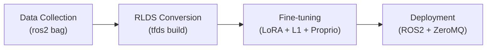
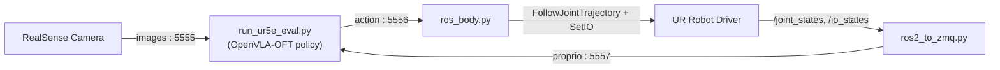

# OpenVLA-OFT for UR5e Pick & Place

Fine-tuning **OpenVLA-7B** with the **OFT** recipe (LoRA + L1-regression action head + action chunking + proprioception) for autonomous **Pick & Place** on a **UR5e** arm, served in real time through a **ROS2 + ZeroMQ** pipeline.

---

## Overview

The model takes a single RGB image, the robot's proprioceptive state (6 joint angles + gripper), and a language instruction, and predicts a chunk of 7-D actions (6 absolute joint angles + 1 gripper command). Actions are streamed to the robot over ZeroMQ and executed via the UR ROS2 driver.

The project covers the full pipeline: **data collection → RLDS conversion → fine-tuning → real-robot deployment.**



---

## Runtime Architecture

Deployment runs as separate processes communicating over ZeroMQ.



| Port | Channel | Producer → Consumer |
|------|---------|---------------------|
| 5555 | RGB images | `camera_stream.py` → inference |
| 5557 | Proprio (joints + gripper) | `ros2_to_zmq.py` → inference |
| 5556 | Action (joints + gripper) | inference → `ros_body.py` |

---

## Tech Stack

- **Robot:** Universal Robots UR5e + Robotiq gripper (Tool Digital Output, `DOUT0`)
- **OS / Middleware:** Ubuntu 24.04, ROS2 Jazzy, UR ROS2 driver
- **Sensing:** Intel RealSense (`realsense2_camera`)
- **Model:** OpenVLA-7B + LoRA, OFT fine-tuning (L1 regression, action chunking, proprio)
- **IPC:** ZeroMQ
- **Compute:** PyTorch / CUDA, conda environments

---

## Repository Structure

```
openvla-oft/
├── vla-scripts/
│   └── finetune.py              # LoRA + OFT fine-tuning entry point
├── experiments/robot/ur5e/
│   └── run_ur5e_eval.py         # Inference policy (loads VLA + action head + proprio projector)
├── camera_stream.py             # RealSense → ZMQ (:5555)
├── ros2_to_zmq.py               # /joint_states + /io_states → ZMQ proprio (:5557)
├── ros_body.py                  # ZMQ action (:5556) → UR5e execution
├── merge_lora_weights_and_save.py
├── runs/                        # checkpoints (gitignored)
└── my_dataset/                  # raw rosbags (gitignored)
```

> **Note:** Model weights, checkpoints, and raw datasets are not tracked in git. Run the pipeline below to generate them.

---

## Pipeline

### 1. Data Collection
Record synchronized camera, joint, and gripper streams with the robot teleoperated through the pendant.

```bash
ros2 bag record /joint_states \
                /camera/camera/color/image_raw \
                /io_and_status_controller/io_states
```

### 2. RLDS Conversion
Convert the rosbags into an RLDS dataset (`ur5e_pick_and_place_dataset`) using a custom TFDS builder.

```bash
tfds build --overwrite
```

### 3. Fine-tuning
LoRA fine-tuning with the OFT recipe.

```bash
torchrun --standalone --nnodes 1 --nproc-per-node 1 vla-scripts/finetune.py \
    --vla_path "openvla/openvla-7b" \
    --dataset_name "ur5e_pick_and_place_dataset" \
    --use_l1_regression True \
    --use_proprio True \
    --image_aug True \
    --batch_size 1 --grad_accumulation_steps 16 \
    --max_steps 5000 \
    --save_latest_checkpoint_only True
```

### 4. Deployment
Launch the processes (separate terminals): UR driver → `camera_stream.py` → `ros2_to_zmq.py` → `run_ur5e_eval.py` → `ros_body.py`.

---

## Model & Training Config

| Item | Value |
|------|-------|
| Base model | `openvla/openvla-7b` |
| Method | OFT: LoRA + L1-regression head + action chunking + proprio |
| LoRA rank | 32 |
| Effective batch size | 16 (1 × 16 grad accum) |
| Learning rate | 5e-4 |
| Training steps | 5000 |
| Action space | 7-D — 6 absolute joint angles + 1 gripper |
| Proprio | 7-D — 6 joint angles + 1 gripper state |
| Gripper convention | `1.0` = open, `0.0` = closed (`DOUT0`) |
| Action normalization | q99 bounds |

---

## Notes & Limitations

- **Gripper control:** The gripper signal is weak in the current dataset, so inference uses a lightweight state machine that switches the task instruction (`pick → place → return home`) based on gripper proprio feedback. More demonstrations would improve learned gripper behavior.
- **Task scope:** Trained on a constrained Pick & Place setup (single object, fixed place location, a few pick positions). Generalization is limited by data scale.

---

## Acknowledgements

- [OpenVLA](https://github.com/openvla/openvla)
- [OpenVLA-OFT](https://github.com/moojink/openvla-oft) — [paper](https://arxiv.org/abs/2502.19645)
